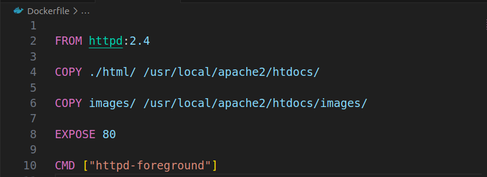
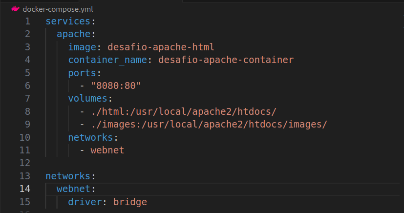

# Desafio Container de uma aplicação Web - DIO
---
### 📚 Bootcamp Deal - Spring Boot e Angular (17+) - Docker e Containeres

---

### Dockerfile

### Docker-compose

---

### 🎯 Objetivo do Desafio

 Este desafio visa criar uma aplicação web simples com o conteúdo que foi ensinado durante o curso de Docker e containeres.

**Resultado:** Site interativo com algumas cores

## 🎥 Demonstração do site

---

### 🛠️ Ferramentas

- HTML
- JavaScript
- Docker
- Docker Compose
- Apache (httpd)
- Git
- GitHub

---

## 🚀 Configuração do Ambiente

- **Docker**: Utilizado para criar e configurar um ambiente isolado para o servidor Apache.
  - **Dockerfile**: Definido para configurar o contêiner do Apache, incluindo a instalação do servidor e a cópia dos arquivos da aplicação para o contêiner.

- **Docker Compose**: Utilizado para orquestrar e gerenciar os contêineres.
  - **docker-compose.yml**: Arquivo de configuração que define o serviço Apache e como ele deve ser executado.

- **Apache (httpd)**: Servidor web configurado para hospedar a aplicação dentro do contêiner Docker.

- **Git** e **GitHub**: Utilizados para controle de versão e gerenciamento do código e da configuração do projeto. O código e as configurações foram versionados e armazenados no GitHub para colaboração e controle de alterações.

## 📒 Como rodar a Aplicação

**Pré-requisitos:**
- Máquina Virtual (ex: VirtualBox) com Ubuntu configurado
- Docker instalado na máquina virtual
- Docker Compose instalado na máquina virtual

**Passos para Rodar:**

1. Clone o repositório na máquina virtual: `git clone https://github.com/seu-usuario/desafio-apache-html.git`
2. Navegue até o diretório do projeto: `cd desafio-apache-html`
3. Suba os contêineres com o Docker Compose: `docker-compose up`
4. Verifique o IP da sua máquina virtual e acesse a aplicação no navegador. Por exemplo: `http://192.168.15.12:8080/` (Substitua pelo IP correto, se necessário).

---

  &nbsp;&nbsp;
  &nbsp;&nbsp; 
&nbsp;&nbsp;
  &nbsp;&nbsp;
  &nbsp;&nbsp;
  &nbsp;&nbsp;
  

